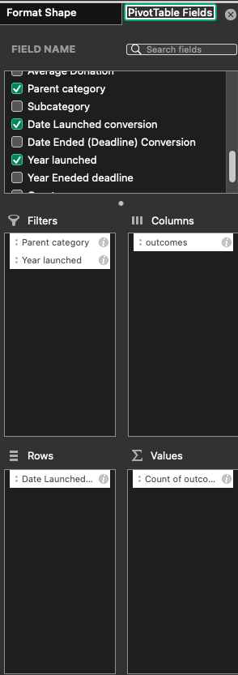

# **Kickstarting with Excel**

## **Overview of Project**
### **Purpose and Background**
Our client's one of the plays are coming closer to reaching its fundraising goal in the near future. This project aims to find patterns between successful campaigns, plays in particular and their connection to the launch time and the goal or target amount.

## **Analysis and Challenges**
### **Analysis of Outcomes Based on Launch Date - Part 1**
The analysis was performed by creating a pivot chart and selecting the criteria for pivot fields accordingly. The pivot field criteria have been depicted in the image below. 

No challenges were faced during the analysis of this part. 

### **Analysis of Outcomes Based on Goals - Part 2**
To analyse the outcomes of the plays based on goals, 3 criteria were selected to populate the number of successful, failed and canceled plays. 
- The word ***Plays*** from the Subcategory column of the Kickstarter sheet
- The word ***successful*** from the Outcomes column of the Kickstarter sheet
- The goal amount is from the Goal column of the Kickstarter sheet.

### **Challenges and Difficulties Encountered**
In Part 1, the challenges could have been faced while applying the filters in the pivot chart. These particular challenges can be resolved by logically deciding which criteria to put in the appropriate pivot fields.

The analysis of Part 2 was a little challenging than the first part. I got an error with the CountIfs formula. It was a simple typographical error where I typed ***play*** instead of ***plays***. No other challenges were faced. Once the formula for Column B ***Number successful*** was ready, the other formulas for column C and D only required the word change from ***successful*** to ***failed*** and ***canceled***.

## **Results**

- ### ***What are two conclusions you can draw about the Outcomes-based on Launch Date?***
Based on the analysis the followings can be conculded:
* The least favourable month to launch a theatre performace would be December. There number of factors for low success rate in December with the prominent one could be due to the holidays season.
* The most favourable time to launch a thetre performance would be MAy, Jun and July. Amogst all three months, the month of May has a stastical edge to succeed the most.

- ### ***What can you conclude about the Outcomes based on Goals?***
* One of the main conclusions one can draw from the analysis of goals based on the outcome is, higher the goal of the play, the lesser its chances to get succeed. Of course, there are a few anomalies or outliers where plays succeeded despite of higher financial goals. Still, the number of those plays are significantly less compared to the successful ones with relatively lower financial goals.

- ### ***What are some limitations of this dataset?***
There are a few limitations of the dataset, which includes but are not limited to the following:
* the dataset could have been more granular level to specify the state or region. For example, for the US data, the States could have been specified to help us gauge variation of success rate between the States.
* The de-identified data of the backers, for example, their background age and gender, would have been helpful to target the particular group of people who are more likely to donate to meet the goal of the play or some other item.
* The demographics of the audience who attended the play would be helpful for the target of the marketing campaigns.

- ### ***What are some other possible tables and/or graphs that we could create?***
* The graphs or tables based on the average donation comparing the outcome of the play would be helpful.
* Also, the graph depicting the analysis of the number of backers and its success rate would also be also be help us our client to make more informed decsision.
